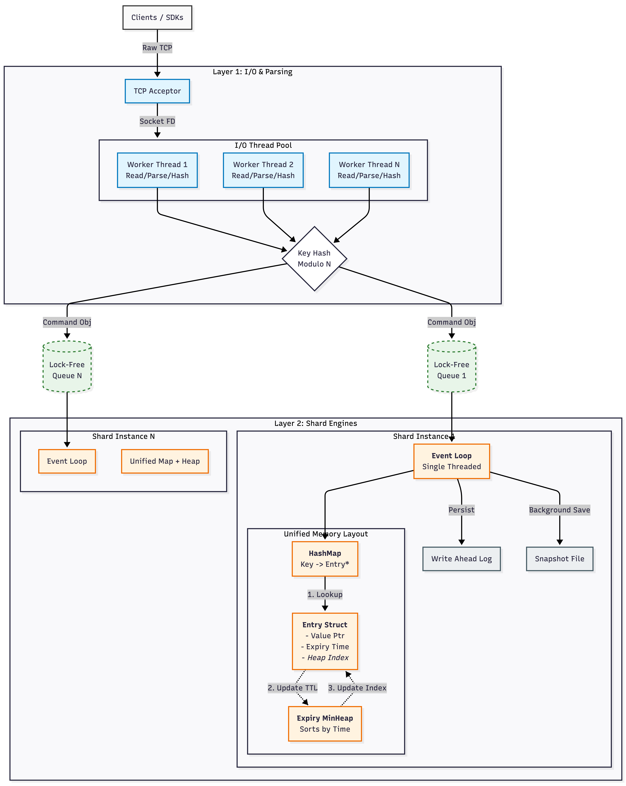

# 🦀 CrabKV: Multi-Threaded Sharded Store

Yo, this is **CrabKV**. We built this in **Rust** because we don't do race conditions and we definitely don't do garbage collection pauses.

It’s an **async, sharded, persistent** key-value store running on **Tokio**. We used to be single-threaded (MVP vibes), but we just dropped the **Sharding Update**. Now we saturate every core you have.

**Status:** **Production Ready** (on my machine). 🐐

## 🗿 Why It’s Based (Features)

* **Sharded Architecture 🍰**: We implemented **M:N Threading**. I/O threads parse requests, Shard Engine threads execute them. No global locks. Pure throughput.
* **Async Core ⚡**: Built on Tokio. We use channels and lock-free queues. Mutexes are for boomers.
* **Persistent (WAL) 📝**: writes go to `wal.log` instantly. Server crash? Skill issue. We recover instantly.
* **Unified Memory Layout 🧠**: `HashMap` + `MinHeap` linked by raw pointers. Cache locality is immaculate.
* **TTL (Ghost) 👻**: Keys expire automatically. Clean up your garbage.
* **Protocol 🤝**: Simple TCP text protocol. `netcat` friendly.

## 🏗 The Architecture

We aren't just throwing `Mutex<HashMap>` around. We built a proper **Shared-Nothing** architecture.

1. **Layer 1 (I/O)**: A pool of Tokio workers accepts TCP, parses text, hashes the key, and pushes to a specific shard queue.
2. **Layer 2 (Engines)**: dedicated threads that own specific shards. No locking. Just consuming the queue and writing to the WAL.



## 📂 The Stack (Structure)

Clean architecture only. No spaghetti code allowed.

```text
├── src
│   ├── engine          # Core primitives (Command definitions, WAL, Snapshot)
│   │   ├── apply.rs    # Command logic
│   │   ├── command.rs  # Enum definitions
│   │   ├── parser.rs   # Text -> Struct
│   │   ├── snapshot.rs # JSON dumping
│   │   └── wal.rs      # Append-only log
│   ├── server          # Networking layer (I/O Thread Pool)
│   │   ├── connection.rs 
│   │   └── mod.rs
│   ├── shard_engine    # THE NEW STUFF (Sharding Logic) 🔥
│   │   ├── engine.rs   # The Event Loop
│   │   ├── router.rs   # Key -> Shard routing
│   │   ├── shard.rs    # The isolated data store
│   │   └── mod.rs
│   └── main.rs         # Entry point & Runtime setup
├── snapshot.json       # Persisted DB state
└── wal.log             # Append-only operation log

```

## 🚀 Deployment

### Prereqs

* **Rust**: Use the latest stable toolchain. Don't be that guy on version 1.60.

### Run It

Clone it, ship it.

```bash
# Clone
git clone https://github.com/Shan-N/crabkv.git

# Release Build (Debug is for weakness)
cargo run --release

```

Server binds to `127.0.0.1:3000`. We live.

### Usage

Hit it with `nc`.

```bash
$ nc localhost 3000
SET user:1 "based rust dev"
OK
GET user:1
"based rust dev"
SETEX cache_key "i disappear soon" 10 
OK

```

## 🛠 Command Tier List

| Command | Usage | Description |
| --- | --- | --- |
| **SET** | `SET k v` | Lock it in. 🔒 |
| **GET** | `GET k` | Fetch the alpha. |
| **DEL** | `DEL k` | Nuke it. 💥 |
| **SETEX** | `SETEX k t v` | Ephemeral storage. |
| **TTL** | `TTL k` | Final countdown. |

## 🗺 Grindset (Roadmap)

* [x] **Sharding**: `todo!("add sharding")` — **DONE.** We split the keyspace. We scaled the reads. We are massive. 🚀
* [ ] **Binary Protocol**: Text parsing is still kinda mid. We need Protobufs or custom binary format.
* [ ] **Cluster Mode**: Raft consensus? Maybe later.
* [ ] **Client Lib**: Native Rust crate incoming.

## 📄 License

MIT. Fork it. Ship it.

---

**Built with 🦀 and Sleep Deprivation by Shannn.**